# Deterministic and/or Sigmoid?

So, the transformer architecutre came with a limitation of not distinguishing input from context and hence prompt injection is still an un solved problem.

"Due to fundamental limitations of language models, one must assume that if an LLM is supplied with untrusted input, it will produce arbitrary output. When that input includes private information, one must also assume that the model will output private information." - Microsoft, 2023
[https://arxiv.org/html/2501.07238v1]

Aside of this, essential measurements around:
* recall-to-precision
* model drift + error compounding
* tokenomics
* scale
are key areas for discovery that are currently at the root cause of the infamous "95% AI startups ..." paper by MIT NANDA.

Here is a decision tree to help Architects around this evolving new programming paradigm.

```mermaid
flowchart TD
    %% Main Entry Point
    Start([🎯 System Design Decision]) --> Context{What's the Context?}

    %% Context Branch
    Context -->|User Interface| UI{User Action Type?}
    Context -->|Data Processing| Data{Data Characteristics?}
    Context -->|ML/AI System| ML{Learning Required?}
    Context -->|Control System| Control{Control Precision?}

    %% User Interface Branch
    UI -->|Binary Choice| UIDet[🔘 Deterministic UI<br/>Buttons, Toggles, Menus]
    UI -->|Gesture/Voice| UISig[📱 Sigmoid UI<br/>Swipe Sensitivity, Voice Recognition]
    UI -->|Mixed Interaction| UIHybrid[🔄 Hybrid UI<br/>Smart Defaults + Manual Override]

    %% Data Processing Branch
    Data -->|Structured/Clean| DataDet[📊 Deterministic Processing<br/>SQL Queries, Rule-based Logic]
    Data -->|Noisy/Uncertain| DataSig[🌊 Sigmoid Processing<br/>Probabilistic Models, Fuzzy Logic]
    Data -->|Batch + Stream| DataHybrid[⚡ Hybrid Processing<br/>Rules + ML Confidence Scoring]

    %% ML/AI Branch
    ML -->|Classification Only| MLDet[🎯 Deterministic ML<br/>Decision Trees, Rule-based AI]
    ML -->|Probability Needed| MLSig[🧠 Sigmoid ML<br/>Neural Networks, Bayesian Models]
    ML -->|Explainable AI| MLHybrid[🔍 Hybrid ML<br/>Interpretable Models + Confidence]

    %% Control System Branch
    Control -->|Binary States| ControlDet[⚡ Deterministic Control<br/>Digital Switches, State Machines]
    Control -->|Gradual Response| ControlSig[🎛️ Sigmoid Control<br/>PID Controllers, Servo Systems]
    Control -->|Fault Tolerance| ControlHybrid[🛡️ Hybrid Control<br/>Graceful Degradation]

    %% Additional Decision Factors
    UIDet --> Factors{Consider Additional Factors}
    UISig --> Factors
    UIHybrid --> Factors
    DataDet --> Factors
    DataSig --> Factors
    DataHybrid --> Factors
    MLDet --> Factors
    MLSig --> Factors
    MLHybrid --> Factors
    ControlDet --> Factors
    ControlSig --> Factors
    ControlHybrid --> Factors

    %% Final Considerations
    Factors --> Performance{Performance Critical?}
    Factors --> Safety{Safety Critical?}
    Factors --> Cost{Cost Sensitive?}

    Performance -->|Yes| PerformanceRec[⚡ Favor Deterministic<br/>Predictable, Fast Execution]
    Performance -->|No| FlexibilityCheck{Need Flexibility?}

    Safety -->|Yes| SafetyRec[🛡️ Favor Deterministic<br/>Predictable Failure Modes]
    Safety -->|No| AdaptabilityCheck{Need Adaptability?}

    Cost -->|Yes| CostRec[💰 Consider Hybrid<br/>Balance Complexity vs Features]
    Cost -->|No| QualityCheck{Quality Priority?}

    FlexibilityCheck -->|Yes| FlexRec[🔄 Favor Sigmoid<br/>Adaptive, Learning Systems]
    FlexibilityCheck -->|No| SimpleRec[🎯 Use Deterministic<br/>Simple, Reliable]

    AdaptabilityCheck -->|Yes| AdaptRec[🧠 Favor Sigmoid<br/>Self-adjusting Systems]
    AdaptabilityCheck -->|No| StableRec[⚖️ Use Deterministic<br/>Stable, Consistent]

    QualityCheck -->|Yes| QualityRec[✨ Consider Sigmoid<br/>Smooth User Experience]
    QualityCheck -->|No| BasicRec[📋 Use Deterministic<br/>Basic Functionality]

    %% Styling
    classDef deterministic fill:#d4f1d4,stroke:#5cb85c,stroke-width:3px,color:#000
    classDef sigmoid fill:#fff3cd,stroke:#f0ad4e,stroke-width:3px,color:#000
    classDef hybrid fill:#cce5ff,stroke:#004085,stroke-width:3px,color:#000
    classDef decision fill:#f8d7da,stroke:#d9534f,stroke-width:2px,color:#000
    classDef recommendation fill:#e2e3e5,stroke:#383d41,stroke-width:2px,color:#000

    class UIDet,DataDet,MLDet,ControlDet deterministic
    class UISig,DataSig,MLSig,ControlSig sigmoid
    class UIHybrid,DataHybrid,MLHybrid,ControlHybrid hybrid
    class Context,UI,Data,ML,Control,Factors,Performance,Safety,Cost,FlexibilityCheck,AdaptabilityCheck,QualityCheck decision
    class PerformanceRec,SafetyRec,CostRec,FlexRec,SimpleRec,AdaptRec,StableRec,QualityRec,BasicRec recommendation
```

